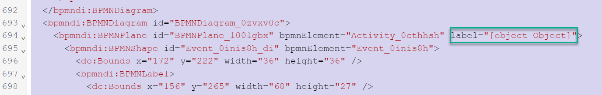
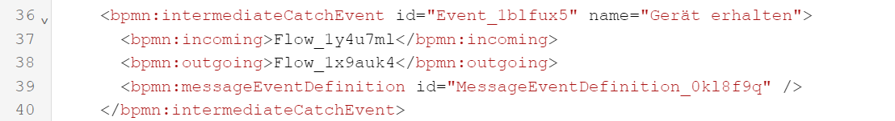
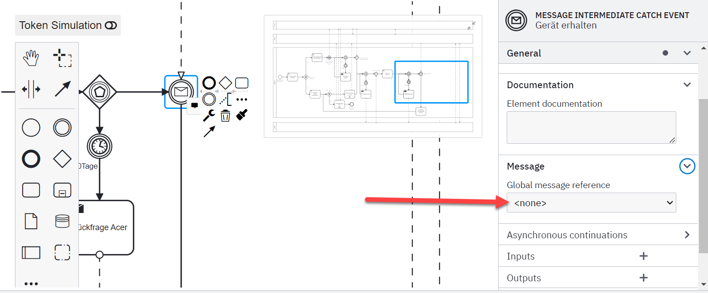

# Gemachte Erfahrungen

In diesem Kapitel werde ich meine Semesterarbeit reflektieren.


[Quelle](../Quellenverzeichnis/index.md#erfahrungen)

# Probleme

## Github CI/CD Pipeline für Github Pages

Anfangs hatte ich Probleme Github Pages für meine Semesterarbeit einzurichten und wusste nicht ganz wo anfangen. Ich wusste aber, dass Yves Wetter von meiner Klasse bereits damit gearbeitet hat und konnte ihn um Hilfe bitten. Was ich falsch gemacht habe, war das vorgesehen Repository in meines zu klonen, damit Github die benötigte Struktur erhält, um somit dann das Jeykill Template auf Github Pages hosten zu können.

## Camunda BPMN

Das Erstellen des BPM im *Camunda Modeler* hat sehr gut funktioniert. Was dann jedoch problematisch wurde, war das Hochladen des modellierten BPMN auf den Camunda Container. Ich erhielt einige Fehlermeldungen, welche ich länger versucht habe zu lösen, leider ohne Erfolg. Dies hatte zur Folge, dass ich nicht weiter arbeiten konnte.

1. Ich erhielt jedes Mal beim Öffnen vom *Camunda Modeler* folgende Fehlermeldung 

```
[C:\Users\dennis.buathong\OneDrive\Dokumente\Gitrepos\ITCNE23\2.Semster\BPM\BPMN\Reparaturfall_ISE\Grundgeruest.bpmn] unknown attribute <label> [ warning ]"
```

Ich konnte dann zusammen mit dem Fachexperten Thomas Kälin das Problem beheben. Ich musste dazu das modellierte BPMN im XML Format anzeigen lassen und jeden "Label" Eintrag löschen.



2. Ich konnte das BPMN nicht auf den Container laden wegen diverser *MESSAGE INTERMEDIATE CATCH EVENT* errors (Zeile 39). Diese habe ich erhalten, weil im ich im Modeler vergessen habe für diese eine *Global message reference* zu definieren. Diese wird später verwendet, um über die REST-API Nachrichten an Camunda zu senden, damit der Prozess weiterlaufen kann [Messaging](3.4%20Improve.md#messaging). 



Ich konnte das Problem beheben, indem ich auf dem *MESSAGE INTERMEDIATE CATCH EVENT* unter *Message -> Global message reference* einen Wert eingetragen habe. Wie vorhin beschrieben, ist dieser wichtig um dann die REST-API Abfrage durchführen zu können.

