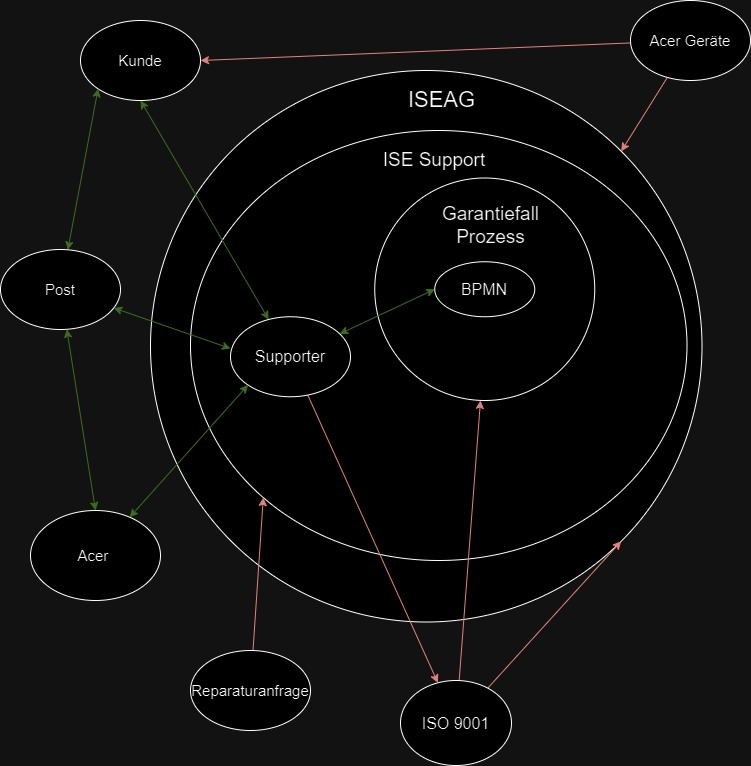

# SEUSAG

Um die Systemabgrenzungen zu veranschaulichen, habe ich ein SEUSAG erstellen. Somit werden Systemgrenzen geklärt, Einflussgrössen ermittelt, Unter - / Teilsysteme isoliert, Schnittstellen definiert, Analysen von Elementen - Dimensionen und Beziehungen erstellt und Gemeinsamkeiten erkannt.

