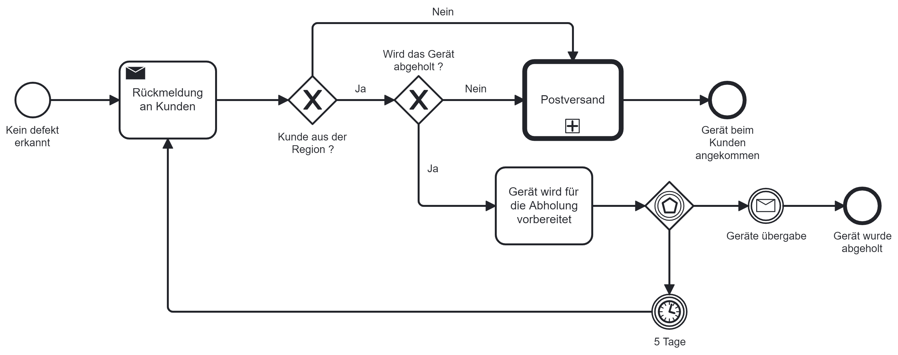
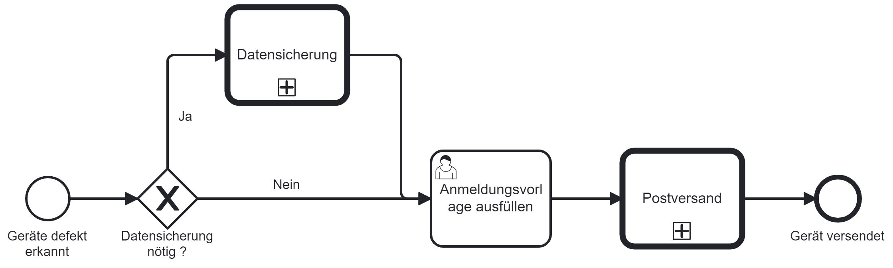

# Improve Phase

Da ich mit der Qualitätsmanagementmethode *Lean Six Sigma* arbeite, werde ich Schritt für Schritt den *DMAIC* Zyklus durchgehen und somit den Prozess zu bearbeiten. 

Der vierter Schritt dazu ist die *Improve Phase*. Was in dieser Phase genau geschieht, wird in der Einleitung unter Punkt 2.5 Projektmanagement-Methode beschrieben.


[Quelle](../Quellenverzeichnis/index.md#improve)


[Quelle](../Quellenverzeichnis/index.md#camunda)

### Was ist Camunda ?

Camunda ist eine Softwareplattform, die Unternehmen dabei unterstützt, ihre Geschäftsprozesse effizient zu verwalten. Diese Plattform bietet Funktionen für das Business Process Management (BPM) und die Workflow-Automatisierung.

Im Bereich BPM ermöglicht Camunda die Modellierung, Ausführung und Überwachung von Geschäftsprozessen. BPM konzentriert sich darauf, Geschäftsabläufe systematisch zu analysieren und zu verbessern, um die Gesamteffizienz einer Organisation zu steigern.

Ein Hauptmerkmal von Camunda liegt in der Automatisierung von Workflows. Unternehmen können Regeln und Bedingungen festlegen, um Geschäftsprozesse automatisch ablaufen zu lassen. Dies trägt dazu bei, menschliche Fehler zu minimieren und die Konsistenz in den Abläufen zu gewährleisten.

Die Plattform bietet zudem Tools zur visuellen Modellierung von Prozessen. Benutzer können so einen klaren Überblick darüber erhalten, wie Aufgaben innerhalb ihres Unternehmens strukturiert sind. Diese Modelle dienen als Grundlage für die Implementierung automatisierter Workflows.

Insgesamt unterstützt Camunda Unternehmen dabei, ihre Geschäftsprozesse effizienter zu gestalten und eine bessere Kontrolle über ihre Abläufe zu erlangen.

### Umsetzung (Improve)

Ich konnte das Flussdiagramm erfolgreich durch ein Camunda-BPMN ersetzen. Ich habe alle analysierten Probleme erkannt und behoben. Das ganze habe ich mit dem Camunda Modeler umgesetzt. Das *KnowHow* habe ich mir durch das aktive mitarbeiten während des BPM Unterrichts bei Thomas Kälin und durch da Praxishandbuch *BPMN von Jabok Freund und Bernd Rücker - Mit Einführung in DMN, 6. Auflage* erarbeitet.
[Praxishandbuch BPMN](https://www.hanser-elibrary.com/doi/epdf/10.3139/9783446461123.fm)

So sieht der Prozess im BPMN aus:


Weil das Bild leider etwas zu gross ist, kann man es hier nochmals besser einsehen:
[BPMN_GarantiefallProzess](https://1drv.ms/i/s!AkAN2Wz9R_53goQICLz8rEPNkftU2w?e=LvYNnn)

So sieht der Subprozess *Rückgabe-prozess* aus:


So sieht der Subprozess *Einsende-prozess Acer* aus:


Die Fett umrandeten Tasks werden *Aufruf-Aktivitäten* oder *Call-Activitiys* genannt. Diese repräsentieren einen global definierten Prozess oder eine global definierte Aufgabe, der bzw. die im aktuellen Prozess verwendet wird. Diese wurden so verwendet, weil die Beschreibung dieser Prozesse den Umfang dieser Semesterarbeit überschreiten würden.

Damit keine Excel-Liste mehr geführt werden muss, habe ich ein *Camunda-Forms* erstellt, in welchem man in 2 Tasks Informationen abfüllen muss. 

Das *Forms* sieht wie folgt aus:


Weil das Bild leider etwas zu gross ist, kann man es hier nochmals besser einsehen:
[Form](https://1drv.ms/i/s!AkAN2Wz9R_53goREWuEt0j0-VElWLw?e=PtvGRq)

Hier können die Bedeutungen der Symbole eingesehen werden:
[Camunda Symbole](../Quellenverzeichnis/index.md#camunda-symbole)

### Camunda Container

Damit interaktiv mit dem erstellten Camunda BPMN arbeiten kann, stellt Camunda einen Container via Docker zur Verfügung, mit welchem man eine Prozessinstanz starten kann. Dieser wird lokal betrieben und soll später dann auf Azure gehosted werden.

### REST API

[Camunda Platform REST API](http://localhost:8080/swaggerui/#/Message/deliverMessage)

Damit gewisse Prozesse durchlaufen, muss dem System bekannt gegeben werden, dass spezifische Ereignisse eingetroffen sind. Diese können direkt über Swagger UI ausgeführt werden.

#### Messaging

So sehen die REST-API Abfragen aus. Für jedes *MESSAGE INTERMEDIATE CATCH EVENT*, wird eine separate Abfrage gestartet, sobald der Fall eintrifft. So wird z.B. sobald die Case-ID von Acer geliefert wird, das Messaging so durchgeführt, dass der Prozess weiterlaufen kann.

- Case-ID erhalten

```
{
  "messageName" : "Case-ID erhalten",
  "businessKey" : "1",
  "processVariables" : {
    "Erhalten" : {"value" : "Case ID erhalten", "type": "String"
    }
  }
}
```

- Gerät erhalten

```
{
  "messageName" : "Geraet erhalten",
  "businessKey" : "1",
  "processVariables" : {
    "Erhalten" : {"value" : "Gerät erhalten", "type": "String"
    }
  }
}
```

- Geräte Übergabe

 ```
{
  "messageName" : "Geraeteuebergabe",
  "businessKey" : "1",
  "processVariables" : {
    "Abgeben" : {"value" : "Gerät wurde übergeben", "type": "String"
    }
  }
}
```

- Rückmeldung erhalten

 ```
{
  "messageName" : "Rueckmeldung erhalten",
  "businessKey" : "1",
  "processVariables" : {
    "Rückmeldung" : {"value" : "Rückmeldung von Kunden erhalten", "type": "String"
    }
  }
}
```