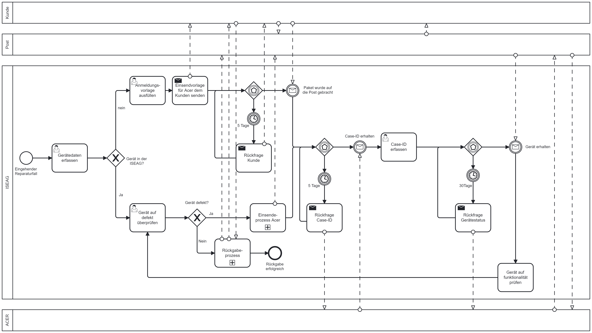

# Improve Phase

Da ich mit der Qualitätsmanagementmethode *Lean Six Sigma* arbeite, werde ich Schritt für Schritt den *DMAIC* Zyklus durchgehen und somit den Prozess zu bearbeiten. 

Der vierter Schritt dazu ist die *Improve Phase*. Was in dieser Phase genau geschieht, wird in der Einleitung unter Punkt 2.5 Projektmanagement-Methode beschrieben.

[Quelle](../Quellenverzeichnis/index.md#improve)

[Quelle](../Quellenverzeichnis/index.md#camunda)

### Was ist Camunda ?

Camunda ist eine Softwareplattform, die Unternehmen dabei unterstützt, ihre Geschäftsprozesse effizient zu verwalten. Diese Plattform bietet Funktionen für das Business Process Management (BPM) und die Workflow-Automatisierung.

Im Bereich BPM ermöglicht Camunda die Modellierung, Ausführung und Überwachung von Geschäftsprozessen. BPM konzentriert sich darauf, Geschäftsabläufe systematisch zu analysieren und zu verbessern, um die Gesamteffizienz einer Organisation zu steigern.

Ein Hauptmerkmal von Camunda liegt in der Automatisierung von Workflows. Unternehmen können Regeln und Bedingungen festlegen, um Geschäftsprozesse automatisch ablaufen zu lassen. Dies trägt dazu bei, menschliche Fehler zu minimieren und die Konsistenz in den Abläufen zu gewährleisten.

Die Plattform bietet zudem Tools zur visuellen Modellierung von Prozessen. Benutzer können so einen klaren Überblick darüber erhalten, wie Aufgaben innerhalb ihres Unternehmens strukturiert sind. Diese Modelle dienen als Grundlage für die Implementierung automatisierter Workflows.

Insgesamt unterstützt Camunda Unternehmen dabei, ihre Geschäftsprozesse effizienter zu gestalten und eine bessere Kontrolle über ihre Abläufe zu erlangen.

### Umsetzung

Ich konnte das Flussdiagramm erfolgreich durch ein Camunda-BPMN ersetzen. Ich habe alle analysierten Probleme erkannt und behoben. Das ganze habe ich mit dem Camunda Modeler umgesetzt.

So sieht der Prozess nun aus.

Weil das Bild leider etwas zu gross ist, kann man es hier nochmals besser einsehen:
[BPMN_GarantiefallProzess](https://1drv.ms/i/s!AkAN2Wz9R_53goQICLz8rEPNkftU2w?e=LvYNnn)

