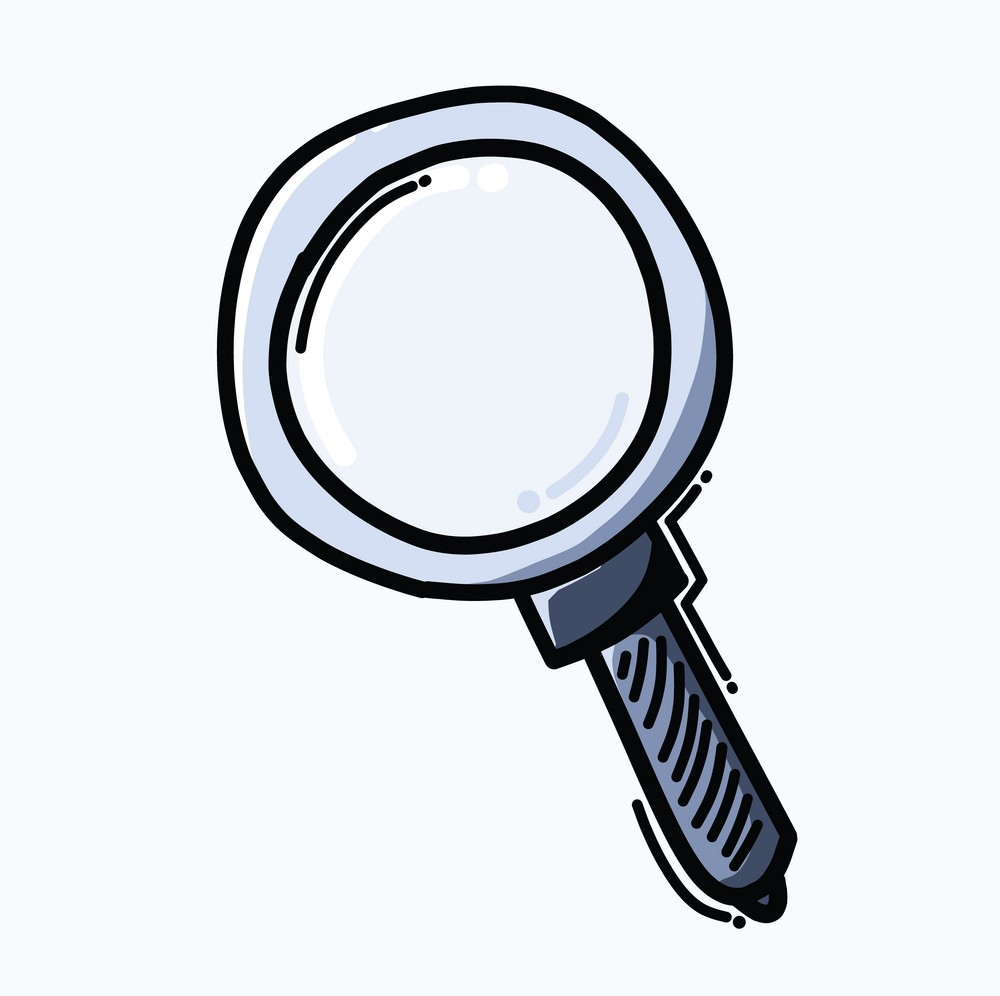

# Quellenverzeichnis

Im Quellenverzeichnis findet man die Quellen der genutzten Bilder und Quellen der genutzten Informationen.

[Quelle](../Quellenverzeichnis/index.md#Quellenverzeichnis-Logo)

# Bilder

### Startseite
[Welcome](https://www.picng.com/upload/welcome/png_welcome_54228.png)

### Einleitung
[First thinks first](https://cdn2.vectorstock.com/i/1000x1000/05/61/light-bulb-glowing-sketch-draw-vector-35850561.jpg)

### ISO-9001
[ISO 9001](https://reciprocity.com/wp-content/uploads/2021/10/faq_iso9001_featured-img_730x270_small.jpg)

### Goals
[Goal](https://images.squarespace-cdn.com/content/v1/5760269145bf21440773e26c/1532517734122-G2XKNP3V3X2SG2CC9Z95/Goals.jpg?format=2500w)
### Kanban-Board
[Kanban-Board](https://www.ingenieur.de/wp-content/uploads/2019/01/Kanban-Board-illustriert_B74336643_bakhtiarzein-e1547564483745.jpg)

### Scrum-Methode
[Scrum-Methode](https://media.graphassets.com/j3ITgEIYTVmdAXePjpoR)

### Lean-Six-Sigma
[Lean Six Sigma](https://www.georgiaruralhealth.org/wp-content/uploads/2022/01/lean-6-sigma.png)

### Sprint
[Sprint](https://cdn-icons-png.flaticon.com/512/5065/5065388.png)

### Hauptteil
[BPM](https://movan.vn/wp-content/uploads/sites/156/2020/05/bpm.png)

### Quellenverzeichnis-Logo
[Luppe](https://cdn1.vectorstock.com/i/1000x1000/12/55/magnifying-glass-doodle-color-icon-drawing-sketch-vector-33421255.jpg)

### Abschluss
[Review](https://timelesshrsolutions.files.wordpress.com/2016/12/employee-performance-review.jpg)

