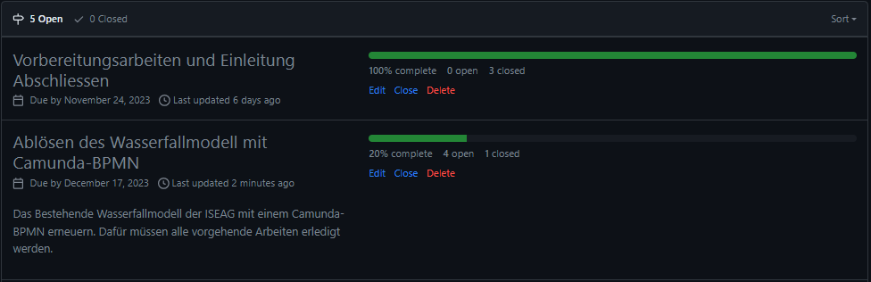
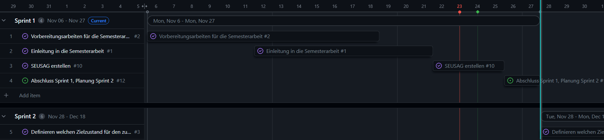
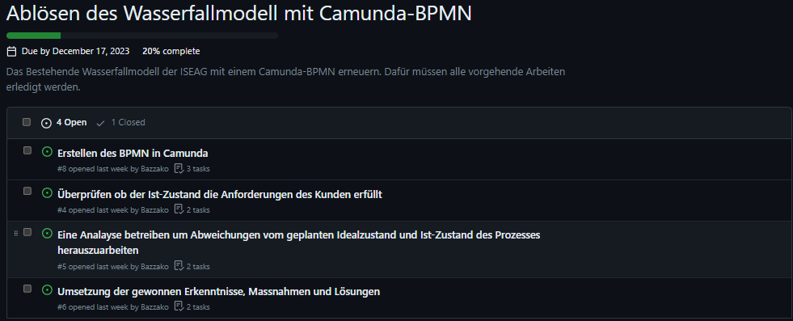

# 1. Sprintabschluss

Rückblicken auf den ersten Sprint kann ich sagen, dass ich gut im Zeitplan liege. Ich konnte bereits schon vorarbeiten und habe somit den die Erste Phase des *DMIAC Zyklus* abgeschlosse (Define Phase). Ich habe somit meinen Ersten Meilenstein erfolgreich abgeschlossen.

Im Gantt-Diagramm (Gantt Nach Sprints) sieht es aktuell wie folgt aus. Der blaue Strich visualisiert das Ende des 1.Sprints.

## Wieso bin ich meine Zeitplan voraus ?

Da das Projekt das Geschäft betriff und die Supportanfragen immer weniger werden, konnte ich mir während der Arbeitszeit an der Semestarbeit arbeiten. Ausserdem habe ich in einigen Homeschooling-sessions mich mit meine Semesterarbeit auseinander gesetzt.

## Was ist mir gut gelaufen, worauf baue ich auf ?

Ich bin sehr motiviert und möchte diese Motivation über die ganze Semesterarbeit hinweg beibehalten. Durch die Hilfe von einem Klassenkameraden, konnte ich erfolgreich das Jekyll Template *Just the Docs* verwenden und auf Github-Pages hosten lassen. Ich finde, dass die Dokumentation mit diesem Template sehr übersichtlich und sauber aussieht, was mir viel Freude bereitet.

## Blick auf den 2.Sprint

Da ich bereits dem Zeitplan voraus bin, bin ich zuversichtlich, dass ich alle Meilensteine des 2.Sprints rechtzeigt abschliessen werde. Im 2.Sprint wird es spannender, da ich dann meine ersten Praxisaufgaben erledigen werde.

Im 2.Sprint muss ich folgendenden Meilenstein vollenden.

