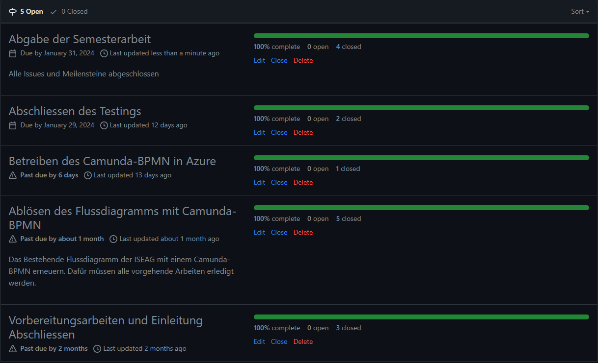
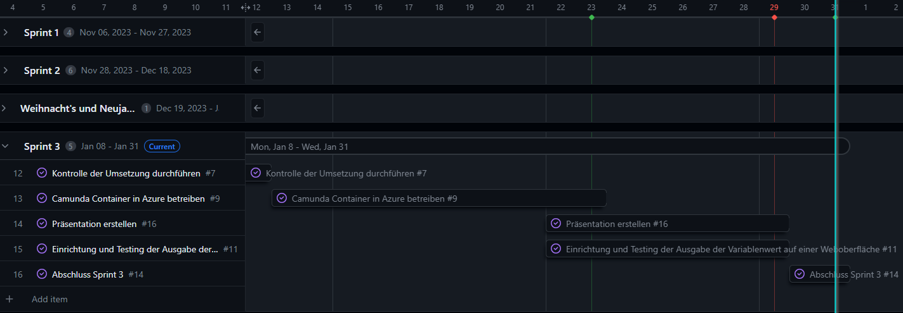

# 3. Sprintabschluss

Rückblicken auf den ersten Sprint kann ich sagen, dass ich die Semesterarbeit erfolgreich abschliessen konnte. Alle Meilensteine und Issues wurden erledigt und abgeschlossen.

Im Gantt-Diagramm (Gantt Nach Sprints) sieht es aktuell wie folgt aus. Der blaue Strich visualisiert das Ende des 3.Sprints.

## Wie ist es mir ergangen ?

Der letzte drittel der Semesterarbeit war nochmals streng. Die geplante Weihnachtspause hat mir nicht gutgetan, da ich die letzte Woche ziemlich krank wurde und somit die Ferien in Thailand nicht richtig geniessen konnte. Der Arbeitsstart nach den Ferien war daher auch nicht besonders aufregend, ich fühlte mich vermehrt schwach, träge und motivationslos. Zum guten Glück konnte ich mich aber nach einigen Tage wieder fangen und mich wieder motivieren den letzten Teil der Semesterarbeit in Angriff zu nehmen. Wie man oben entnehmen kann, konnte ich den schriftlichen Teil der Semesterarbeit erfolgreich abschliessen. Was jetzt noch fehlt, ist das Kolloquium.

## Schlusswort

Die Reflexion und das Schlusswort habe ich in meiner Semesterarbeit [hier](../Abschluss/Erfahrungen#reflexion-der-ganzen Semesterarbeit) bereits dokumentiert.